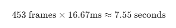

## 🚀 성능 이슈 분석 및 디버깅 결과 (2026-02-01)

### 1. 개요

최근 업데이트된 이미지 처리 로직(물리적 비트맵 복사 및 회전) 도입 이후, 앱의 전반적인 성능 저하 및 트래킹 중단 현상이 발생함. `Logcat` 분석 결과, 비효율적인 리소스 관리로 인해 시스템 가용 자원이 고갈되고 MediaPipe 엔진의 전제 조건이 파괴되는 것을 확인하였음.

### 2. 주요 결함 분석 (Smoke Test 결과)

#### ① 메모리 폭격 및 LOS GC 오버헤드 (MemoryCheck & GC)

* **현상**: `08:41:16`~`08:43:10` 구간 확인 결과, **초당 평균 15~20회의 비트맵(480x640) 생성**이 지속됨.
* **원인**: `createBitmap` 및 `toBitmap`을 통한 무분별한 메모리 할당으로 인해 대형 객체 영역인 **LOS(Large Object Space)**가 순식간에 점유됨.
* **결과**: 시스템이 메모리를 확보하기 위해 **초당 1회 이상의 강제 GC**를 수행하며, 이 과정에서 한 번에 약 **200ms~300ms의 시스템 정지(Stop-the-world)**가 발생함.
* **물증**: `NativeAlloc concurrent copying GC freed ... LOS objects` 로그가 반복적으로 확인됨.

#### ② UI 스레드 점유 및 7초 프리징 (Choreographer)

* **현상**: 특정 시점에서 **`Skipped 453 frames!`** 로그 기록됨.
* **분석**: 안드로이드 60fps 기준, 이는 약 **7.5초 동안 화면이 완전히 멈춘 상태**임을 의미함.
* **원인**: 비동기 리스너 내부에서 메인 스레드 전환 로직 없이 무거운 연산이 수행되거나, 극심한 GC 부하로 인해 UI 스레드가 작업 스케줄링에서 밀려남.
* **결과**: 발표자가 제스처를 취해도 화면이 갱신되지 않아 실시간 제어 불능 상태에 빠짐.

#### ③ MediaPipe 엔진 전제 조건 파괴 (Timestamp Reverse)

* **현상**: `GestureHelper` 및 `PoseHelper`에서 **`failed precondition: The received packets having a smaller timestamp than the processed timestamp`** 에러 지속 발생.
* **원인**: `fixedThreadPool(2)`를 사용하여 비트맵을 물리적으로 회전시키는 과정에서, 연산 속도 차이로 인해 **프레임 전달 순서가 뒤바뀜(Race Condition)**.
* **결과**: MediaPipe 엔진은 타임스탬프가 역전된 데이터 입력을 거부하고 분석을 중단함. **트래킹이 갑자기 멈추는 현상의 직접적인 원인**임.

#### ④ 시스템 차원의 앱 강제 종료 전조 (ActivityManager)

* **현상**: 시스템 로그에서 `ActivityManager: Killing ... packageinstaller/reminder` 등 주변 앱을 강제 종료하는 행위 포착.
* **분석**: 대상 앱이 메모리를 과도하게 점유하자, OS가 이를 살리기 위해 백그라운드 앱들을 정리하는 **'Low Memory Killer' 전조 현상**임. 방치 시 대상 앱 자체가 OOM(Out of Memory)으로 종료될 가능성 100%.

---

새벽부터 고생하며 찾아낸 데이터들을 팀원들에게 설명할 때, **"단순히 렉이 걸려요"**라고 말하는 것보다 **"시스템 리소스의 임계치를 넘어 엔진 전제 조건이 파괴되었습니다"**라고 말하는 것이 훨씬 전문적이고 설득력 있습니다.

README.md에 그대로 활용하시거나, 나중에 팀장님께 기술적인 근거를 제시할 때 참고할 수 있도록 각 결함의 의미와 파급력을 자세히 정리해 드릴게요.

---

## 🛠️ 주요 성능 결함 기술 분석 (설명)

### 1. 메인 스레드 점유 및 7.5초 프리징 (`Skipped 453 frames!`)

안드로이드의 모든 화면 그리기는 **메인 스레드(UI Thread)**에서 일어납니다. 이 스레드는 1초에 60번(약 **16.6ms** 간격) 화면을 갱신해야 합니다.

* **의미**: `Choreographer` 로그는 메인 스레드가 너무 바빠서 화면을 그릴 기회를 놓쳤을 때 발생합니다.
* **분석**: 453프레임 스킵은 산술적으로 

 동안 화면이 단 한 번도 갱신되지 않고 멈춰 있었음을 뜻합니다.
* **원인**: 비동기로 처리되어야 할 비트맵 생성 로직이나 MediaPipe 리스너 내부의 상태 업데이트가 메인 스레드 자원을 과도하게 점유하거나, 뒤에서 설명할 **GC 부하**로 인해 CPU가 메인 스레드 작업을 후순위로 밀어냈기 때문입니다.

### 2. LOS(Large Object Space) 기반의 메모리 폭격 및 시스템 정지

안드로이드의 가비지 컬렉터(GC)는 객체의 크기에 따라 관리 구역을 나눕니다. 비트맵처럼 용량이 큰 객체는 **LOS(Large Object Space)**에 할당됩니다.

* **의미**: 로그상에서 `NativeAlloc concurrent copying GC`가 1~2초마다 발생하고 `LOS objects`가 수십 MB씩 해제되고 있다는 것은, 메모리가 비트맵 복사본들로 인해 **쓰레기장**이 되었다는 뜻입니다.
* **분석**: GC는 메모리를 청소하는 동안 앱의 동작을 일시 정지시키는 **'Stop-the-world'** 현상을 유발합니다. 현재 로그에 찍힌 **200~300ms**의 정지는 실시간 서비스에서 허용 범위를 수십 배 초과한 수치입니다.
* **원인**: `CameraPage.kt`에서 매 프레임마다 `toBitmap()`과 `createBitmap()`을 중복 호출하면서, 생성된 비트맵을 `recycle()`로 명시적 해제하지 않아 메모리 파편화와 점유율이 극에 달했기 때문입니다.

### 3. 멀티스레드 경합에 의한 타임스탬프 역전 (`Precondition Failed`)

MediaPipe의 실시간 인식 엔진(`detectAsync`)은 입력되는 데이터의 타임스탬프가 반드시 **오름차순(단조 증가)**이어야 한다는 엄격한 전제 조건을 가집니다.

* **의미**: `failed precondition: The received packets having a smaller timestamp than the processed timestamp` 에러는 엔진에 프레임이 **순서대로 들어오지 않았음**을 비명 지르는 것입니다.
* **분석**: `fixedThreadPool(2)`를 사용하는 환경에서 1번 스레드가 Frame A를, 2번 스레드가 Frame B를 처리할 때, Frame B의 물리적 회전 연산이 더 빨리 끝나버리면 엔진에는 **B가 A보다 먼저 전달**됩니다.
* **결과**: 엔진은 이를 '논리적 오류'로 판단하여 **분석을 중단(Tracking Drop)**합니다. 손 트래킹이 갑자기 멈추는 현상의 결정적 원인이며, 이는 연산이 무겁고 순서 보장이 안 되는 현재 아키텍처의 구조적 결함입니다.