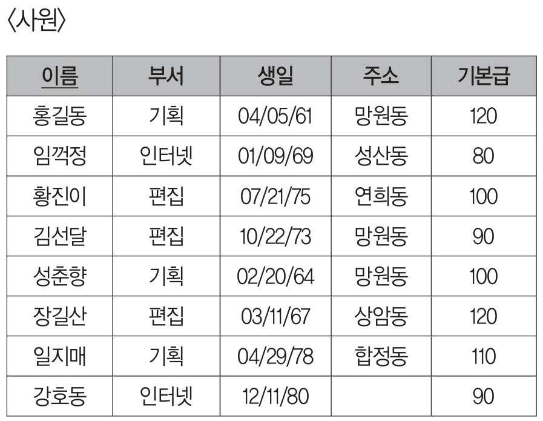
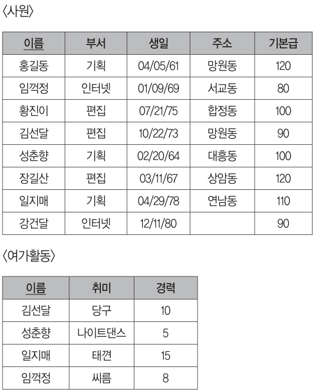
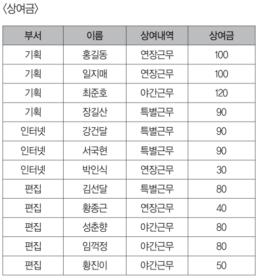

# 정처기 SQL 정리

상태: 예정

## DDL (Data Define Lagnuage, **데이터 정의어)**

**DB를 구축**하거나 **수정**할 목적으로 사용하는 언어
*명령어를 확실히 외우고 영단어 뜻 그 자체로 기능 이해할 것

| 명령어 | 기능 |
| --- | --- |
| CREATE | SCHEMA, DOMAIN, TABLE, VIEW, INDEX를 **정의** |
| ALTER | TABLE에 대한 **정의를 변경** |
| DROP | SCHEMA, DOMAIN, TABLE, VIEW, INDEX를 **삭제** |

### CREATE INDEX

```sql
CREATE [UNIQUE] INDEX 인덱스명
ON 테이블명(속성명 [ASC|DESC] [,속성명[ASC|DESC]])
[CLUSTER];
```

- UNIQUE: **사용된 경우 중복 값 불허**, 생략된 경우 중복 값 허용하는 속성으로 인덱스 생성
- **정렬** 여부는 ASC 또는 DESC가 **생략**되면 자동 **오름차순**
- CLUSTER: 인덱스가 클러스터드 인덱스로 설정
*클러스터드 인덱스: 테이블의 실제 데이터 저장 순서를 인덱스 순서에 맞춰 정렬해 두는 인덱스, **테이블 하나에는 클러스터드 인덱스를 보통 하나만 만듦**(한 가지 기준으로만 정렬될 수 있기 때문)

<aside>

**예제**

<고객> 테이블에서 UNIQUE한 특성을 갖는 ‘고객번호’ 속성에 대해 내림차순으로 정렬하여 ‘고객번호_idx’라는 이름으로 인덱스를 정의하시오

```sql
CREATE UNIQUE INDEX 고객번호_idx
ON 고객(고객번호 DESC);
```

</aside>

### ALTER TABLE

```sql
ALTER TABLE 테이블명 ADD 속성명 데이터_타입 [DEFAULT '기본값'];
ALTER TABLE 테이블명 ALTER 속성명 [SET DEFAULT '기본값'];
ALTER TABLE 테이블명 DROP COLUMN 속성명 [CASCADE];
```

- ADD: 새로운 속성(열)을 추가
- ALTER: 특정 속성의 Default 값을 변경
- DROP COLUMN: 특정 속성 삭제

<aside>

**예제 1**

<학생> 테이블에 최대 3문자로 구성되는 ‘학년’ 속성을 추가하시오

```sql
ALTER TABLE 학생 ADD 학년 VARCHAR(3);
// VARCHAR(N): 문자열을 최대 N글자까지 저장할 수 있는 **가변 길이 문자형**
```

**예제 2**

<학생> 테이블의 ‘학번’ 필드의 데이터 타입과 크기를 VARCHAR(10)으로 하고 NULL 값이 입력되지 않도록 변경하시오

```sql
ALTER TABLE 학생 ALTER 학번 VARCHAR(10) AND NOT NULL;
```

</aside>

### DROP

```sql
DROP SCHEMA 스키마명 [CASCADE|RESTRICT];
DROP DOMAIN 도메인명 [CASCADE|RESTRICT];
DROP TABLE 테이블명 [CASCADE|RESTRICT];
DROP VIEW 뷰명 [CASCADE|RESTRICT];
DROP INDEX 인덱스명 [CASCADE|RESTRICT];
DROP CONSTRAINT 제약조건명;
```

- CASCADE: 제거할 요소를 참조하는 다른 모든 개체 함께 제거
- RESTRICT: 다른 개체가 제거할 요소를 참조 중일 때는 제거를 취소

<aside>

**예제**

<학생> 테이블을 제거하되, <학생> 테이블을 참조하는 모든 데이터를 함께 제거하시오

```sql
DROP TABLE 학생 CASCADE
```

</aside>

---

## DCL (Data Control Language, 데이터 제어어)

데이터의 보안, 무결성, 회복, 병행 제어 등을 정의하는데 사용하는 언어 즉, **데이터베이스 관리자가** **데이터 관리를 목적으로 사용**

| 명령어 | 기능 |
| --- | --- |
| COMMIT | 명령에 의해 수행된 **결과를** 실제 물리적 디스크로 **저장**, DB 조작 작업이 정상적으로 완료되었음을 관리자에게 알림 |
| ROLLBACK | DB 조작 작업이 비정상적으로 종료되어 **원래 상태로 복구** |
| GRANT | DB 사용자에게 사용 **권한 부여** |
| REVOKE | DB 사용자의 사용 **권한 취소** |

### GRANT / REVOKE

```sql
GRANT 권한_리스트 ON 개체 TO 사용자 [WITH GRANT OPTION];

REVOKE [GRANT OPTION FOR] 권한_리스트 ON 개체
FROM 사용자 [CASCADE];
```

- 권한 종류: ALL, SELECT, INSERT, DELETE, UPDATE 등
- WITH GRANT OPTION: 부여받은 권한을 다른 사용자에게 다시 부여할 수 있는 권한 (예시: DB 관리자 → 개발팀장 → 개발팀원)
- GRANT OPTION FOR: 다른 사용자에게 권한을 부여할 수 있는 권한을 취소

<aside>

**예제 1**

사용자 ID가 “NABI”인 사람에게 <고객> 테이블에 대한 모든 권한과 다른 사람에게 권한을 부여할 수 있는 권한까지 부여하는 SQL 문을 작성하시오.

```sql
GRANT ALL ON 고객 TO NABI WITH GRANT OPTION;
```

---

**예제 2**

사용자 ID가 “STAR”인 사람에게 부여한 <고객> 테이블에 대한 권한 중 UPDATE 권한을 다른 사람에게 부여할 수 있는 권한만 취소하는 SQL문을 작성하시오

```sql
REVOKE GRANT OPTION FOR UPDATE ON 고객 FROM STAR;
```

</aside>

---

## DML (Data Manipulation Language, 데이터 조작어)

**DB 사용자**가 저장된 **데이터를** 실직적으로 **관리**하는데 사용되는 언어

| 명령어 | 기능 |
| --- | --- |
| SELECT | 테이블에서 튜플을 **검색** |
| INSERT | 테이블에 새로운 튜플 **삽입** |
| DELETE | 테이블에서 튜플을 **삭제** |
| UPDATE | 테이블에서 튜플의 내용을 **갱신** |

<aside>

### **예제 풀이용 테이블 (삽입문/삭제문/갱신문)**



</aside>

### 삽입문 (INSERT INTO~)

```sql
INSERT INTO 테이블명([속성명1, 속성명2, ...])
VALUES (데이터1, 데이터2, ...);
```

- 대응하는 속성과 데이터는 **개수와 데이터 유형이 일치**해야함
- 기본 테이블의 모든 속성을 사용할 때는 속성명 생략 가능
- SELECT문을 사용하여 다른 테이블의 검색 결과 삽인 가능

<aside>

**예제 1**

<사원> 테이블에 (이름 - 홍승현, 부서 - 인터넷)을 삽입하시오.

```sql
INSERT INTO 사원 (이름, 부서)
VALUES ('홍승현', '인터넷');
```

---

**예제 2**

<사원> 테이블에 (장보고, 기획, 05/30/73, 홍제동, 90)을 삽입하시오

```sql
INSERT INTO 사원
VALUES ('장보고', '기획', #05/30/73#, '홍제동', 90);
```

- #05/30/73#는 문자열이 아닌 **날짜 데이터**로 데이터를 기입할 때 사용, 현재 표기된건 1973년 5월 30일을 의미함

---

**예제 3**

<사원> 테이블에 있는 편집부의 모든 튜플을 편집 부원(이름, 생일, 주소, 기본급) 테이블에 삽입하시오.

```sql
INSERT INTO 편집 부원(이름, 생일, 주소, 기본급)
SELECT 이름, 생일, 주소, 기본급
FROM 사원
WHERE 부서='편집';
```

</aside>

### 삭제문 (DELETE FROM~)

```sql
DELETE FROM 테이블명 [WHERE 조건];
```

- 모든 레코드를 삭제할 때는 WHERE절 생략
- 모든 레코드를 삭제해도 테이블 구조는 남아있으므로 DROP과는 다름

<aside>

**예제 1**

<사원> 테이블에서 “임꺽정”에 대한 튜플을 삭제하시오.

```sql
DELETE FROM 사원 WHERE 이름='임꺽정';
```

---

**예제 2**

<사원> 테이블에서 ‘인터넷’ 부서에 대한 모든 튜플을 삭제하시오.

```sql
DELETE FROM 사원 WHERE 부서='인터넷';
```

---

**예제 3**

<사원> 테이블의 모든 레코드를 삭제하시오

```sql
DELETE FROM 사원;
```

</aside>

### 갱신문 (UPDATE~ SET~)

```sql
UPDATE 테이블명
SET 속성명 = 데이터[, 속성명=데이터, ...]
[WHERE 조건];
```

<aside>

**예제 1**

<사원> 테이블에서 “홍길동”의 “주소”를 “수색동”으로 수정하시오

```sql
UPDATE 사원 SET 주소 = '수색동' WHERE 이름 = '홍길동';
```

---

**예제 2**

<사원> 테이블에서 “황진이”의 부서를 “기획부”로 변경하고 ‘기본급’을 5만원 인상시키시오.

```sql
UPDATE 사원
SET 부서 = '기획부', 기본급 = 기본급 + 5
WHERE 이름 = '황진이';
```

</aside>

---

<aside>

### 예제 풀이용 테이블 (SELECT ~ 하위질의)



</aside>

### SELECT

```sql
SELECT [PREDICATE][테이블명,]속성명 [AS 별칭][, [테이블명.]속성명, ...]
FROM 테이블명[, 테이블명, ...]
[WHERE 조건]
[GROUP BY 속성명, 속성명, ...]
[HAVING 조건]
[ORDER BY 속성명 [ASC|DESC]];
```

- SELECT절
    - PREDICATE: 검색할 **튜플 수를 제한**하는 명령어 (DISTINCT: 중복된 튜플이 있으면 그 중 첫번째 한 개만 표시)
    - 속성명: 검색하여 불러올 속성(열) 또는 속성을 이용한 수식을 지정
    - AS: 속성이나 연산의 이름을 다른 이름으로 표시
- FROM절: 검색할 데이터가 들어있는 테이블
- GROUP BY절: **특정 속성을 기준으로 그룹화**하여 검색, 일반적으로 그룹 함수와 함께 사용
- HAVING절: **GROUP BY와 함께 사용**, **그룹에 대한 조건을 지정**
- ORDER BY절: 데이터를 정렬

### 기본 검색

<aside>

**예제 1**

<사원> 테이블의 모든 튜플을 검색하시오

```sql
SELECT * FROM 사원;
```

---

**예제 2**

<사원> 테이블에서 ‘주소’만 검색하되 같은 ‘주소’는 한 번만 출력하시오.

```sql
SELECT DISTINCT 주소 FROM 사원;
```

</aside>

### 조건 지정 검색

WHERE절에서는 비교 연산자, 논리 연산자, LIKE 연산자, IN 연산자를 이용해 조건에 만족하는 튜플만 검색

- LIKE 연산자: 대표 문자를 이용해 **지정된 속성의 값이 문자 패턴과 일치**하는 튜플을 검색
    
    
    | 대표 문자 | % | _ | # |
    | --- | --- | --- | --- |
    | 의미 | 모든 문자를 대표
    글자 수 제한 없이 0개 이상의 모든 문자
    즉, 김%이면 김 뒤에 아무 글자가 와도 되고, 아예 없어도 됨 | 문자 하나를 대표
    예시 김__이면
    총 3글자에서 첫글자가 김인 문자열(김 + 아무 문자 1개 + 아무 문자 1개) | 숫자 하나를 대표
    예시 1#이면 총 2자리이고 첫번째는 1, 두번째는 숫자인 값 |
- IN 연산자: 필드의 값이 IN 연산자의 수로 지정된 값과 같은 레코드만 검색(OR 연산과 결과 동일)

<aside>

**예제 1**

<사원> 테이블에서 ‘기획’부의 모든 튜플을 검색하시오

```sql
SELECT * FROM 사원 WHERE 부서='기획';
```

---

**예제 2**

<사원> 테이블에서 “기획”부서에 근무하면서 “대흥동”에 사는 사람의 튜플을 검색하시오

```sql
SELECT * FROM 사원
WHERE 부서 = '기획' AND 주소 = '대흥동';
```

---

**예제 3**

<사원> 테이블에서 성이 ‘김’인 사람의 튜플을 검색하시오

```sql
SELECT * FROM 사원
WHERE 이름 LIKE "김%";
```

---

**예제 4**
<사원> 테이블에서 ‘생일’이 ‘01/01/69’에서 ‘12/31/73’사이인 튜플을 검색하시오

```sql
SELECT * FROM 사원
WHERE 생일 BETWEEN #01/01/69# AND #12/31/73#;
```

---

**예제 5**

<사원> 테이블에서 ‘주소’가 NULL인 튜플을 검색하시오

```sql
SELECT * FROM 사원
WHERE 주소 IS NULL;
```

</aside>

### 정렬검색

<aside>

**예제 1**

<사원> 테이블에서 ‘부서’를 기준으로 오름차순 정렬하고, 같은 ‘부서’에 대해서는 ‘이름’을 기준으로 내림차순 정렬시켜서 검색하시오.

```sql
SELECT * FROM 사원
ORDER BY 부서 ASC, 이름 DESC;
```

</aside>

### 하위질의

조건절에 주어진 질의를 먼저 수행하여 그 검색 결과를 조건절의 피연산자로 사용

<aside>

**예제 1**

‘취미’가 “나이트댄스”인 사원의 ‘이름’과 ‘주소’를 검색하시오

```sql
SELECT 이름, 주소
FROM 사원
WHERE 이름 = (SELECT 이름 FROM 여가활동 WHERE 취미 = '나이트댄스');
```

- 테이블 구조를 잘 살펴볼 것,,! 두 테이블의 공통 데이터가 이름이고, 취미는 다른 테이블에 있으니 다른 테이블에서 한번 더 찾아서 비교

---

**예제 2**

취미활동을 하지 않는 사원들을 검색하시오

```sql
SELECT * FROM 사원
WHERE 이름 NOT IN (SELECT 이름 FROM 여가활동);
```

---

**예제 3**

“망원동”에 거주하는 사원들의 ‘기본급’보다 적은 ‘기본급’을 받는 사원의 정보를 검색하시오

```sql
SELECT * FROM 사원
WHERE 기본급 < ALL(SELECT 기본급 FROM 사원 WHERE 주소 = '망원동);
```

- SELECT 기본급 FROM 사원 WHERE 주소 = '망원동을 통해서 120, 90이 검색될 것
- 기본급 < ALL(120, 90)으로 즉 모든 범위인 120, 90보다 작은 기본급을 갖는 대상을 찾는 것
</aside>

---

<aside>

### 예제 풀이용 테이블



</aside>

### 그룹 함수

| 명령어 | 기능 |
| --- | --- |
| COUNT(속성명) | 그룹별 튜플 수를 구하는 함수 |
| SUM(속성명) | 그룹별 합계를 구하는 함수 |
| AVG(속성명) | 그룹볍 평균을 구하는 함수 |
| MAX(속성명) | 그룹별 최대값을 구하는 함수 |
| MIN(속성명) | 그룹별 최소값을 구하는 함수 |
| STDDEV(속성명) | 그룹별 표준편차를 구하는 함수 |
| VARIANCE(속성명) | 그룹별 분산을 구하는 함수 |

### 그룹 지정 검색

GROUP BY절에 지정한 속성을 기준으로 자료를 그룹화하여 검색

<aside>

**예제 1**

<상여금> 테이블에서 ‘부서’별 ‘상여금’의 평균을 구하시오

```sql
SELECT 부서, AVG(상여금) AS 평균
FROM 상여금
GROUP BY 부서
```

---

**예제 2**

<상여금> 테이블에서 ‘상여금’이 100 이상인 사원이 2명 이상인 ‘부서’의 튜플 수를 구하시오

```sql
SELECT 부서, COUNT(*) AS 사원수
FROM 상여금
WHERE 상여금 >= 100
GROUP BY 부서
HAVING COUNT(*) >= 2;
```

</aside>

### 집합 연산자를 이용한 통합 질의

집합 연산자를 사용하여 2개 이상의 테이블의 데이터를 하나로 통합

두 개의 SELECT문에 기술한 속성들은 개수와 데이터 유형이 서로 동일해야함

```sql
SELECT 속성명1, 속성명2, ...
FROM 테이블명
UNION | UNION ALL | INTERSECT | EXCEPT
SELECT 속성명1, 속성명2, ...
FROM 테이블명
[ORDER BY 속성명 [ASC|DESC]];
```

| 집합 연산자 | 설명 | 집합 종류 |
| --- | --- | --- |
| UNION | 두 SELECT문의 결과를 **통합**하여 출력
**중복된 행은 한 번만 출력** | 합집합 |
| UNION ALL | 두 SELECT문의 결과를 **통합**하여 출력
**중복된 행도 그대로 출력** | 합집합 |
| INTERSECT | 두 SELECT문의 결과 중 **공통된 행만 출력** | 교집합 |
| EXCEPT | **첫번째 SELECT 결과 - 두번째 SELECT결과** | 차집합 |

---

## JOIN (APPENDIX 참고)

2개의 릴레이션에서 연관된 튜플들을 결합하여, 하나의 새로운 릴레이션을 반환

일반적으로 FROM절에 기술하지만, 릴레이션이 사용되는 곳 어디에나 사용 가능

- OUTER JOIN: 조건이 맞지 않는 데이터도 버리지 않고 가져오는 조인 (LEFT OUTER JOIN, RIGHT OUTER JOIN, FULL OUTER JOIN)
- CROSS JOIN: 조인하는 두 테이블에 있는 튜플들의 순서쌍을 결과로 반환, 결과로 반환되는 테이블의 행의 수 = 두 테이블의 행 수를 곱한 것 (조건 없는 INNER JOIN과 동일한 결과)

### INNER JOIN

두 테이블에서 조건이 서로 맞는 데이터만 가져오는 조인

- THETA JOIN: JOIN에 참여하는 두 릴레이션의 속성 값을 비교하여 조건을 만족하는 튜플만 반환
- EQUI JOIN: 조인에 사용되는 조건 중 = 비교에 의해 같은 값을 가지는 행을 연결하여 결과 생성, 결과로 표시되는 속성(차수)은 두 릴레이션의 속성 합과 같음
- NATURAL JOIN: EQUI JOIN에서 중복된 속성을 제거하여 같은 속성을 한 번만 표기하는 방법
- EQUI JOIN에서 연결 고리가 되는 공통 속성을 JOIN 속성

```sql
// WHERE절을 이용한 EQUI JOIN의 표기 형식
SELECT [테이블명1.]속성명, [테이블명2.]속성명,...
FROM 테이블명1, 테이블명2, ...
WHERE 테이블명1.속성명 = 테이블명2.속성명;

// NATURAL JOIN절을 이용한 EQUI JOIN의 표기 형식
SELECT [테이블명1.]속성명, [테이블명2.]속성명,...
FROM 테이블명 NATURAL JOIN 테이블명2;

// JOIN ~ USING절을 이용한 EQUI JOIN의 표기 형식
SELECT [테이블명1.]속성명, [테이블명2.]속성명,...
FROM 테이블명1 JOIN 테이블명2 USING(속성명);
```

---

## APPENDIX

### JOIN 상세정리(GPT)

<aside>

JOIN은 쉽게 말하면 **두 테이블을 연결해서 하나의 결과처럼 보는 것**이야.

예를 들어 두 테이블이 있다고 해보자.

**학생**

| 학번 | 이름 | 학과코드 |
| --- | --- | --- |
| 1 | 김철수 | C01 |
| 2 | 이영희 | C02 |
| 3 | 박민수 | C03 |

**학과**

| 학과코드 | 학과명 |
| --- | --- |
| C01 | 컴퓨터공학 |
| C02 | 경영학 |
| C04 | 디자인 |

여기서 `학생.학과코드`와 `학과.학과코드`를 기준으로 연결할 수 있어.

---

### 1. INNER JOIN

`INNER JOIN`은 **두 테이블에서 조건이 서로 맞는 데이터만 가져오는 조인**이야.

```sql
SELECT *
FROM 학생
INNER JOIN 학과
ON 학생.학과코드 = 학과.학과코드;
```

결과는:

| 학번 | 이름 | 학과코드 | 학과명 |
| --- | --- | --- | --- |
| 1 | 김철수 | C01 | 컴퓨터공학 |
| 2 | 이영희 | C02 | 경영학 |

왜 `박민수`는 안 나오냐면, 학생 테이블에는 `C03`이 있는데 학과 테이블에는 `C03`이 없기 때문이야.

왜 `디자인`은 안 나오냐면, 학과 테이블에는 `C04`가 있는데 학생 테이블에는 `C04`를 가진 학생이 없기 때문이야.

즉, `INNER JOIN`은 **양쪽에 모두 존재하는 것만 출력**해.

```
INNER JOIN = 교집합
```

---

### 2. OUTER JOIN

`OUTER JOIN`은 **조건이 맞지 않는 데이터도 버리지 않고 가져오는 조인**이야.

종류가 3개 있어.

---

### 2-1. LEFT OUTER JOIN

왼쪽 테이블은 전부 가져오고, 오른쪽 테이블은 조건이 맞는 것만 붙여.

```sql
SELECT *
FROM 학생
LEFT OUTER JOIN 학과
ON 학생.학과코드 = 학과.학과코드;
```

결과는:

| 학번 | 이름 | 학과코드 | 학과명 |
| --- | --- | --- | --- |
| 1 | 김철수 | C01 | 컴퓨터공학 |
| 2 | 이영희 | C02 | 경영학 |
| 3 | 박민수 | C03 | NULL |

`박민수`는 학과코드 `C03`인데, 학과 테이블에 `C03`이 없어.

그래도 **왼쪽 테이블인 학생 데이터는 무조건 출력**하기 때문에 나온다.

대신 연결할 학과명이 없으니까 `NULL`이 들어가.

```
LEFT OUTER JOIN = 왼쪽 테이블 기준으로 전부 출력
```

---

### 2-2. RIGHT OUTER JOIN

오른쪽 테이블은 전부 가져오고, 왼쪽 테이블은 조건이 맞는 것만 붙여.

```sql
SELECT *
FROM 학생
RIGHT OUTER JOIN 학과
ON 학생.학과코드 = 학과.학과코드;
```

결과는:

| 학번 | 이름 | 학과코드 | 학과명 |
| --- | --- | --- | --- |
| 1 | 김철수 | C01 | 컴퓨터공학 |
| 2 | 이영희 | C02 | 경영학 |
| NULL | NULL | C04 | 디자인 |

`디자인` 학과는 학과 테이블에는 있지만, 그 학과에 해당하는 학생은 없어.

그래도 **오른쪽 테이블인 학과 데이터는 무조건 출력**하기 때문에 나온다.

```
RIGHT OUTER JOIN = 오른쪽 테이블 기준으로 전부 출력
```

---

### 2-3. FULL OUTER JOIN

양쪽 테이블의 데이터를 모두 가져와.

조건이 맞으면 붙이고, 안 맞으면 `NULL`로 채워.

```sql
SELECT *
FROM 학생
FULL OUTER JOIN 학과
ON 학생.학과코드 = 학과.학과코드;
```

결과는:

| 학번 | 이름 | 학과코드 | 학과명 |
| --- | --- | --- | --- |
| 1 | 김철수 | C01 | 컴퓨터공학 |
| 2 | 이영희 | C02 | 경영학 |
| 3 | 박민수 | C03 | NULL |
| NULL | NULL | C04 | 디자인 |

```
FULL OUTER JOIN = 양쪽 테이블 전부 출력
```

---

### 한 줄 정리

| 조인 | 의미 |
| --- | --- |
| `INNER JOIN` | 양쪽 테이블에서 조건이 맞는 것만 출력 |
| `LEFT OUTER JOIN` | 왼쪽 테이블은 전부 출력, 오른쪽은 맞는 것만 |
| `RIGHT OUTER JOIN` | 오른쪽 테이블은 전부 출력, 왼쪽은 맞는 것만 |
| `FULL OUTER JOIN` | 양쪽 테이블을 전부 출력 |

진짜 시험식으로 외우면 이렇게야.

```
INNER JOIN = 조건에 맞는 행만
OUTER JOIN = 조건에 안 맞는 행도 포함
LEFT OUTER JOIN = 왼쪽 전체
RIGHT OUTER JOIN = 오른쪽 전체
FULL OUTER JOIN = 양쪽 전체
```

---

### USING

`USING`은 **두 테이블에서 이름이 같은 조인 컬럼을 기준으로 연결할 때, 그 컬럼명을 한 번만 써서 조인 조건을 간단히 표현하는 역할**이야.

예를 들어 두 테이블이 있다고 해보자.

**학생**

| 학번 | 이름 | 학과코드 |
| --- | --- | --- |
| 1 | 김철수 | C01 |
| 2 | 이영희 | C02 |

**학과**

| 학과코드 | 학과명 |
| --- | --- |
| C01 | 컴퓨터공학 |
| C02 | 경영학 |

두 테이블 모두 `학과코드`라는 같은 이름의 컬럼을 가지고 있지?

이때 원래는 이렇게 쓸 수 있어.

```sql
SELECT *
FROM 학생, 학과
WHERE 학생.학과코드 = 학과.학과코드;
```

또는 `JOIN ~ ON`으로 쓰면:

```sql
SELECT *
FROM 학생 JOIN 학과
ON 학생.학과코드 = 학과.학과코드;
```

그런데 컬럼명이 양쪽에서 똑같이 `학과코드`라면 `USING`으로 줄여서 쓸 수 있어.

```sql
SELECT *
FROM 학생 JOIN 학과 USING(학과코드);
```

이 뜻은 내부적으로 이거랑 같아.

```sql
ON 학생.학과코드 = 학과.학과코드
```

즉,

```
USING(학과코드)
= 두 테이블의 학과코드 컬럼 값이 같은 행끼리 조인해라
```

라고 보면 돼.

중요한 조건은 **조인 기준 컬럼명이 두 테이블에서 같아야 한다**는 거야.

가능:

```sql
FROM 학생 JOIN 학과 USING(학과코드);
```

왜냐하면 두 테이블 모두 `학과코드` 컬럼을 가지고 있으니까.

불가능하거나 부적절:

```sql
FROM 학생 JOIN 학과 USING(학생학과코드);
```

학생 테이블에는 `학생학과코드`, 학과 테이블에는 `학과코드`처럼 이름이 다르면 `USING`을 못 쓰고 `ON`을 써야 해.

```sql
FROM 학생 JOIN 학과
ON 학생.학생학과코드 = 학과.학과코드;
```

정리하면:

| 방식 | 사용 상황 |
| --- | --- |
| `WHERE 학생.학과코드 = 학과.학과코드` | 일반적인 EQUI JOIN 조건 |
| `JOIN ... ON 학생.학과코드 = 학과.학과코드` | 조인 조건을 직접 명시 |
| `JOIN ... USING(학과코드)` | 두 테이블의 조인 컬럼명이 같을 때 간단히 표현 |
| `NATURAL JOIN` | 이름이 같은 컬럼을 자동으로 찾아 조인 |

그래서 `USING`은 한마디로 **같은 이름의 컬럼으로 조인할 때 `ON 테이블1.컬럼 = 테이블2.컬럼`을 줄여 쓰는 문법**이야.

</aside>